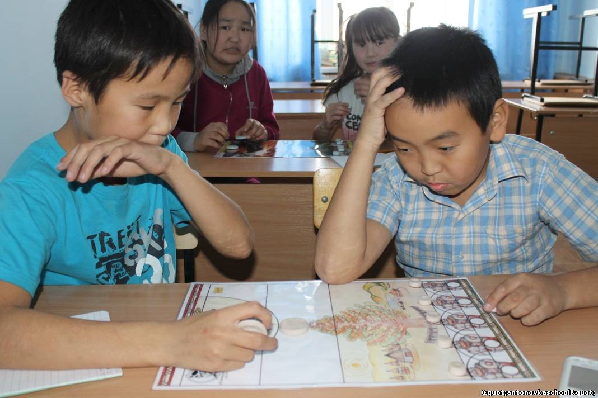

# СОНОР
<figure>
    
</figure>
Цель игры: «убегающие» стараются перейти на противоположную сторону игрового поля до поимки их «преследователем». Тот стремится их поймать как можно дальше от своей стороны поля.

Поимка: «убегающий», которого коснулся «преследователь», считается пойманным и убирается с игрового поля. Баллы: каждый « убегающий», достигший одной из линий I,II или III, получает по одному баллу на каждой линии.

#Как собирать программу
1. С помощью CMake:
mkdir build
cmake -B build -A x64
cmake --build build --config Debug 
2. С помощью командной строки
g++ -c .\main.cpp .\game_class.cpp -I"C:\SFML-2.6.2\include"
g++ .\main.o .\game_class.o -o main_test -L"C:\SFML-2.6.2\lib" -lsfml-graphics -lsfml-window -lsfml-system -lsfml-audio

##ПРЕДУПРЕЖДЕНИЕ ! 11 файлов из папки sfml_хранилище должны находиться в одной директории с исполняемым файлом !!!